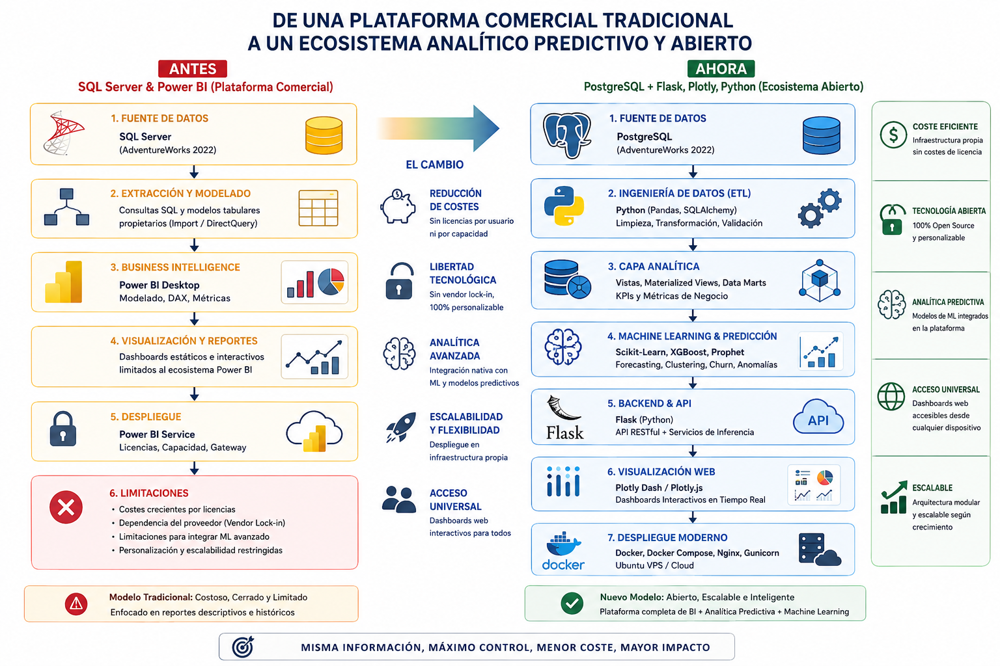
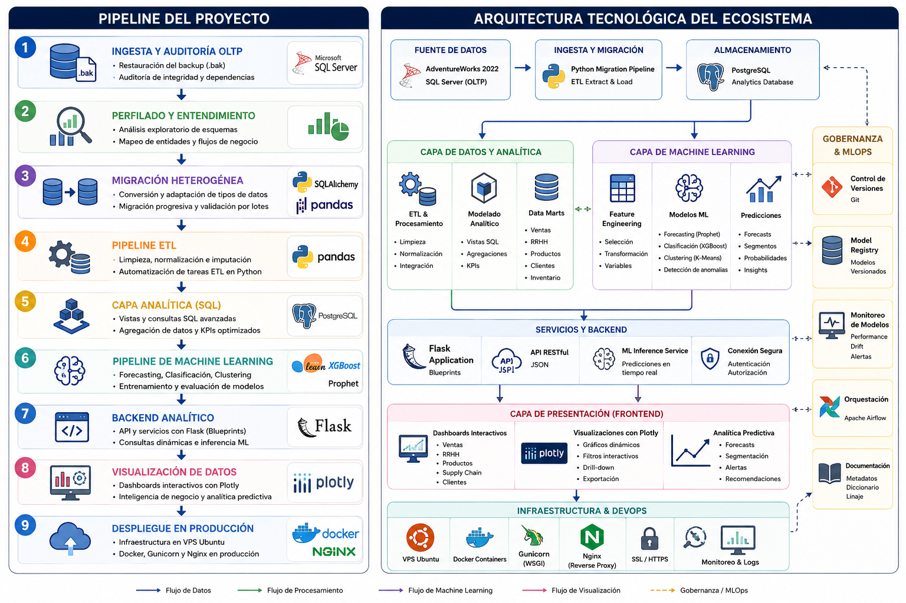

# AdventureWorks: Custom Full-Stack Data & Analytics Platform
> **Caso de Estudio:** Migración desde una Plataforma Comercial Tradicional hacia un Ecosistema Predictivo Propietario.

[](https://opensource.org/licenses/MIT)
[](https://www.python.org/)
[](https://www.postgresql.org/)
[](https://www.docker.com/)


## El Desafío del Negocio (The Problem Statement)
AdventureWorks Inc. gestionaba su inteligencia de negocio a través de una suite analítica tradicional basada en software cerrado. Al escalar, la organización se enfrentó a tres bloqueos críticos:
1. **Escala Exponencial de Costos:** Modelo de licencias insostenible ante el aumento de usuarios concurrentes.
2. **Silos en Data Science:** Dificultad extrema para acoplar modelos avanzados de Machine Learning sin adquirir costosos módulos adicionales del proveedor.
3. **Vendor Lock-in:** Cero control sobre la infraestructura y la interfaz corporativa.

### Nuestra Solución:
Diseñamos y desarrollamos una **plataforma web propietaria, independiente y end-to-end** que migró la infraestructura y transformó los reportes rígidos del pasado en un motor analítico y predictivo centralizado de código abierto.



## Arquitectura del Sistema




## 🛠️ Core Tecnológico (Tech Stack)
* **Infrastructure & DB:** SQL Server (Origen), PostgreSQL (Destino), Docker, Docker Compose, Nginx, Gunicorn.
* **Data Engineering:** Python (v3.11+), SQLAlchemy, Pandas, PyODBC, Psycopg2, Apache Parquet.
* **Data Science & ML:** XGBoost, Meta Prophet, Scikit-Learn, ONNX / Pickle.
* **Backend & Web:** Flask (Blueprints architecture), REST APIs.
* **Frontend:** Plotly, HTML5, CSS3 Custom Dashboards.


## Estructura del Proyecto
```text
adventureworks-fullstack-data-platform/
│
├── config.py                 # Centralización de credenciales y variables de entorno
├── etl_pipeline.py           # Pipeline automatizado de extracción, limpieza y logs
├── app.py                    # Punto de entrada de la aplicación Flask
├── requirements.txt          # Dependencias del proyecto
├── Dockerfile                # Configuración de contenedor para la app web e inferencia
├── docker-compose.yml        # Orquestación multiservicio (Web, Postgres, Nginx)
│
├── sql/
│   ├── extraction/           # Vistas de auditoría y desacoplamiento en SQL Server
│   └── postgres_analytics/   # Vistas analíticas indexadas y agregaciones pesadas
│
├── utils/
│   ├── db_connectors.py      # Gestor de conexiones optimizado con SQLAlchemy
│   └── data_quality.py       # Funciones de validación y limpieza (CheckData)
│
├── models/
│   ├── train/                # Scripts de entrenamiento y reentrenamiento de ML
│   └── artifacts/            # Modelos serializados (.pkl / ONNX) para producción
│
└── templates/ & static/      # Frontend, estilos CSS y componentes interactivos Plotly
``` 

## Flujo Metodológico de Implementación
#### Fase 1 a 3: Ingesta, Calidad y Capa de Extracción
Auditoría mediante scripts SQL individuales para verificar duplicados, rangos y nulos en las 18 tablas operacionales.

Creación de vistas en SQL Server para pre-estructurar datos, aplicar políticas de anonimización de clientes y delegar el cómputo pesado inicial al motor de base de datos.

#### Fase 4 y 5: Migración Heterogénea y ETL en Python
Mapeo dinámico de esquemas entre SQL Server y PostgreSQL mediante SQLAlchemy.

Scripting modular (etl_pipeline.py) con control de calidad estricto (CheckData) y almacenamiento intermedio en archivos Parquet para optimizar rendimiento. Generación de logs automatizados y archivo de trazabilidad datasets_control.xlsx.

#### Fase 6 y 7: Optimización y Backend Analítico
Modelado lógico en PostgreSQL con vistas enriquecidas e indexadas para consolidar Sales, HR, Supply Chain y Product Performance.

Construcción del Backend en Flask utilizando Blueprints para independizar la lógica de cada departamento del negocio.

#### Fase 8 a 10: Analítica Predictiva, UI y MLOps
Implementación de modelos de Machine Learning en producción: Forecasting de ventas (Prophet) y Clasificación de Churn (XGBoost).

Reemplazo de la suite rígida tradicional por dashboards interactivos con Plotly.

Despliegue seguro en un VPS (Ubuntu Server) contenedorizado con Docker Compose, protegiendo la app tras un proxy inverso con Nginx y Gunicorn.

## Requisitos Previos e Instalación
(Próximamente: Instrucciones detalladas de clonado, configuración del archivo .env y ejecución de docker-compose up --build)

## Licencia
Este proyecto está bajo la Licencia MIT. Consulta el archivo LICENSE para más detalles.
